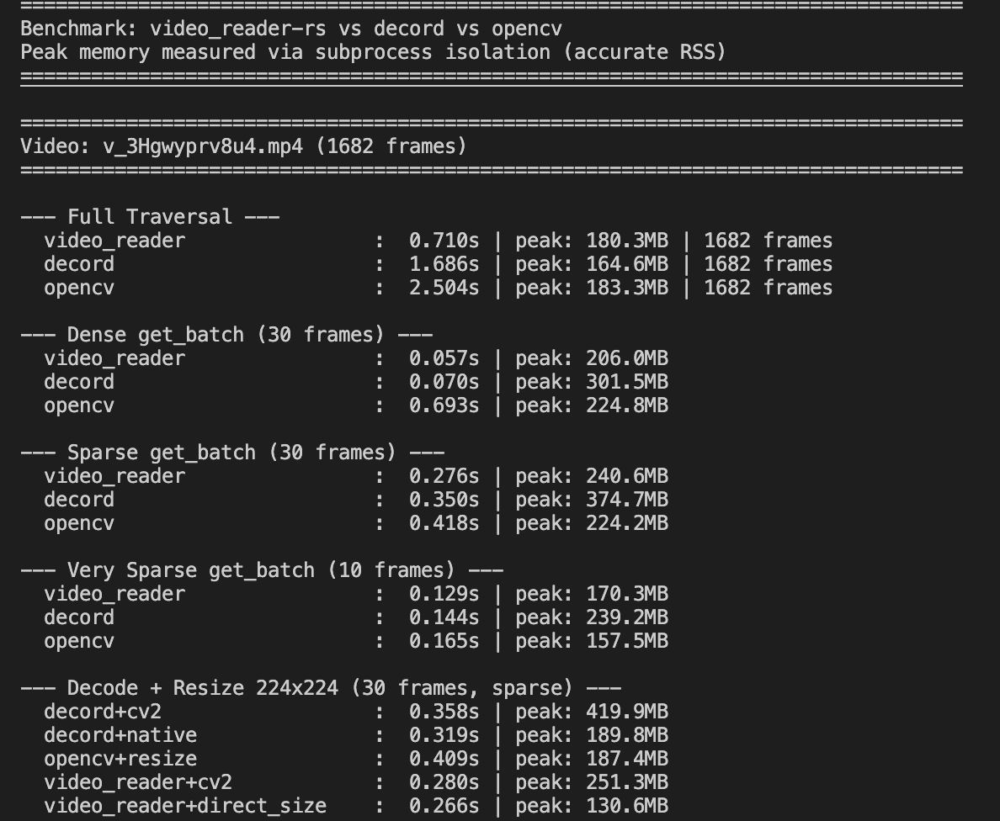
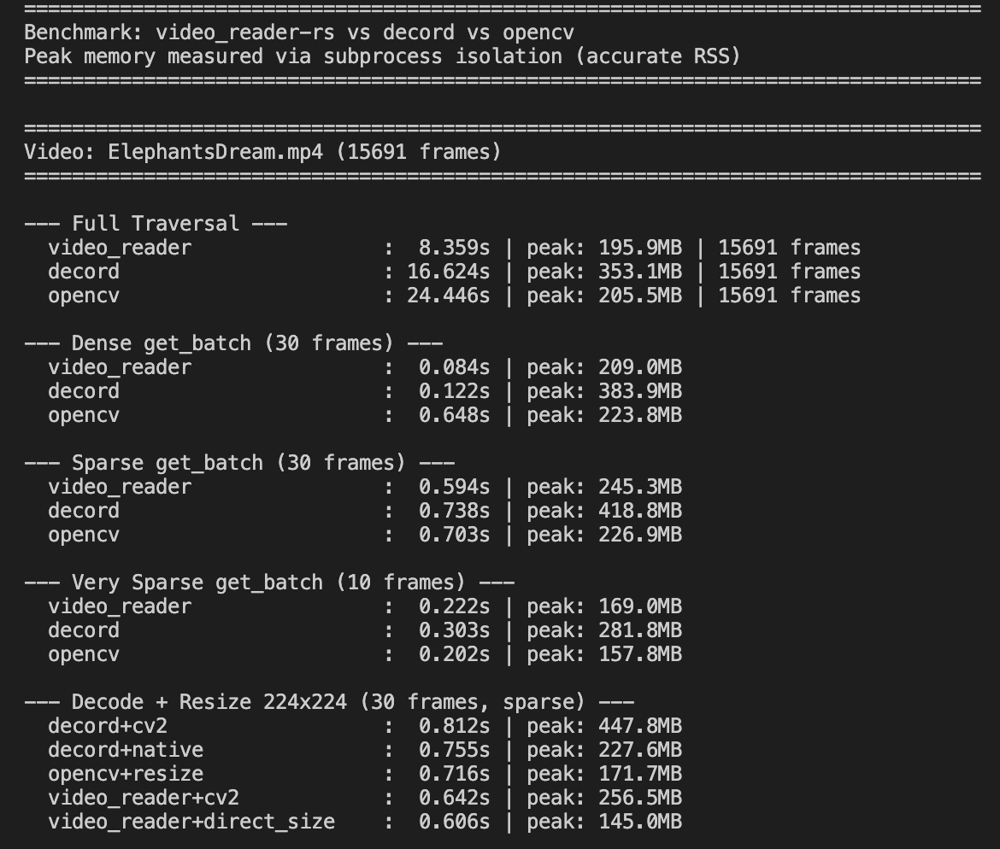

<h1 align="center">
  <code>video-reader-rs-next</code>
</h1>
<p align="center">A Python module for video decoding based on Rust's ffmpeg-next, optimized for ML use cases.</p>

## 💡 Why This Project?

This is a fork of [video_reader_rs](https://github.com/gcanat/video_reader-rs) with extensive fixes and improvements. Key issues addressed are documented in [PR#102](https://github.com/gcanat/video_reader-rs/pull/102).

After these fixes, this library has been **fully validated** on the [LLaVA-Video-178K](https://huggingface.co/datasets/lmms-lab/LLaVA-Video-178K) dataset, which contains many irregular and challenging videos. All random frame access tests—using both seek-based and sequential decoding modes—matched byte-for-byte with full iterator-based decoding. The same validation was also performed on an internal dataset of ~40K videos with consistent results.

This project is separated as a new repository `video-reader-rs-next` for continued development and maintenance. **Issues and contributions are welcome!**

### Key Features

- **⚡ Blazing fast with low memory footprint**: Built with Rust for maximum performance. Significantly faster startup, decoding speed, and lower memory usage compared to alternatives like Decord and OpenCV (see [benchmarks](#-performance) below)
- **Decord-like API**: Familiar `vr[i]`, `vr[start:end]`, and `get_batch()` interface
- **Automatic seek/sequential optimization**: Intelligently chooses the fastest decoding method based on cost estimation
- **Robust handling of irregular videos**: The goal is to be the most compatible video decoding library. Handles:
  - Negative PTS/DTS values
  - Non-monotonic timestamps  
  - Duplicate PTS/DTS
  - Missing PTS/DTS
  - Open GOP structures
  - B-frames at video start with missing references
  - Videos with `backwards jump` (non-monotonic decoder output)
  - Inaccurate frame count metadata
  - **If you encounter any video that fails to decode, please open an issue!**
- **Rotation flag support**: Correctly handles mobile device videos with rotation metadata
- **Custom FFmpeg filters**: Support for scaling, cropping, watermarks (`drawtext`), etc.
- **Hardware acceleration**: Experimental CUDA, VAAPI, VDPAU support (Not fully tested)
- **Out-of-bounds handling**: Skip, black frame, or error modes

---

## 🛠️ Installation

### Install via pip

```bash
pip install video-reader-rs-next
```

Supports Python >= 3.9 on Linux x86_64 and macOS (Apple Silicon).

### Manual Installation

#### macOS (Apple Silicon)

```bash
# Install dependencies
brew install rust ffmpeg

# Install build tools
pip install maturin

# Clone and build
git clone https://github.com/wizyoung/video-reader-rs-next
cd video-reader-rs-next

# Build (use --interpreter to specify Python versions if needed)
maturin build --release
# maturin build --release --interpreter python3.9 python3.10 python3.11 python3.12 python3.13

# Install the wheel
pip install target/wheels/video_reader*.whl
```

#### Debian/Ubuntu (with FFmpeg 8)

**Step 1: Install FFmpeg 8 from source**

```bash
sudo apt-get update
sudo apt-get install -y build-essential yasm nasm pkg-config \
    libx264-dev libx265-dev libvpx-dev libfdk-aac-dev libmp3lame-dev \
    libopus-dev libdav1d-dev libavformat-dev libavcodec-dev libavutil-dev \
    libswscale-dev libavfilter-dev libavdevice-dev \
    libfreetype6-dev libfontconfig1-dev libfribidi-dev libharfbuzz-dev

# Download and build FFmpeg 8
wget https://ffmpeg.org/releases/ffmpeg-8.0.tar.xz
tar xf ffmpeg-8.0.tar.xz
cd ffmpeg-8.0

mkdir -p /opt/ffmpeg8
./configure --prefix=/opt/ffmpeg8 \
  --enable-shared \
  --enable-gpl \
  --enable-libx264 \
  --enable-libx265 \
  --enable-libvpx \
  --enable-libdav1d \
  --enable-libfreetype \
  --enable-libfontconfig \
  --enable-libfribidi \
  --enable-libharfbuzz

make -j$(nproc)
sudo make install
```

**Step 2: Build video-reader-rs-next**

```bash
# Deps
sudo apt install -y clang llvm build-essential libc6-dev pkg-config

# Install Rust
curl --proto '=https' --tlsv1.2 -sSf https://sh.rustup.rs | sh
source "$HOME/.cargo/env"

# Install build tools
pip install maturin patchelf

# Clone
git clone https://github.com/wizyoung/video-reader-rs-next
cd video-reader-rs-next

# Set environment variables for FFmpeg
export PATH=/opt/ffmpeg8/bin:$PATH
export LD_LIBRARY_PATH=/opt/ffmpeg8/lib:$LD_LIBRARY_PATH
export PKG_CONFIG_PATH=/opt/ffmpeg8/lib/pkgconfig:$PKG_CONFIG_PATH
export FFMPEG_DIR=/opt/ffmpeg8

# Build and install
maturin build --release
# maturin build --release --interpreter python3.9 python3.10 python3.11 python3.12 python3.13
pip install target/wheels/video_reader*.whl
```

#### For FFmpeg <= 5

If using FFmpeg 5 or earlier (e.g., from `apt install ffmpeg`), enable the `ffmpeg_5` feature:

```bash
maturin develop --release --features ffmpeg_5
```

---

## 💻 Basic Usage

```python
from video_reader import PyVideoReader

# Open a video file (local path or URL like https://example.com/video.mp4)
vid_path = "video.mp4"

# log_level: FFmpeg log level, default is "error". For corrupted or non-standard videos,
# this may produce a lot of terminal output. Set to "panic" to suppress all warnings.
# Recommended: use "panic" in production.
# Supported log_levels: quiet, panic, fatal, error (default), warning, info, verbose, debug, trace
vr = PyVideoReader(vid_path, log_level='panic')

# threads: number of decoding threads. Default 0 = auto assignment by FFmpeg
vr = PyVideoReader(vid_path, threads=8, log_level='panic')

# Resize shorter side (preserves aspect ratio)
vr = PyVideoReader(vid_path, log_level='panic', resize_shorter_side=480)

# Resize longer side (preserves aspect ratio)
vr = PyVideoReader(vid_path, log_level='panic', resize_longer_side=640)

# Specify exact target dimensions
vr = PyVideoReader(vid_path, log_level='panic', target_width=448, target_height=640)

# resize_algo: default "fast_bilinear"
# Options: fast_bilinear, bilinear, bicubic, nearest, area, lanczos
vr = PyVideoReader(vid_path, log_level='panic', target_width=448, target_height=640, resize_algo='fast_bilinear')

# Access frames (returns numpy array with shape [H, W, C], uint8, RGB)
frame = vr[0]       # First frame
frame = vr[-1]      # Last frame
frames = vr[10:20]  # Frames 10-19 (shape: [10, H, W, C])
frames = vr[10:20:2]  # Every 2nd frame from 10-19

# Batch access (Decord-compatible API, returns [N, H, W, C])
frames = vr.get_batch([0, 2, 4])

# Iterate over all frames
for frame in vr:
    print(frame.shape)
```

---

## 📊 Video Metadata

```python
from pprint import pprint

vr = PyVideoReader("video.mp4")
info = vr.get_info()
pprint(info)

# Output example:
# {'aspect_ratio': 'Rational(1/1)',
#  'bit_rate': '2415080',
#  'chroma_location': 'Left',
#  'codec_id': 'H264',
#  'color_primaries': 'BT709',
#  'color_range': 'MPEG',
#  'color_space': 'BT709',
#  'color_xfer_charac': 'BT709',
#  'duration': '14.966666666666667',
#  'fps': '30',
#  'fps_rational': '30/1',
#  'frame_count': '449',
#  'has_b_frames': 'true',
#  'height': '1280',
#  'intra_dc_precision': '0',
#  'rotation': '0',
#  'start_time': '0',
#  'time_base': '0.00006510416666666667',
#  'time_base_rational': '1/15360',
#  'vid_format': 'YUV420P',
#  'vid_ref': '1',
#  'width': '720'}

fps = vr.get_fps()        # 30.0
n, h, w = vr.get_shape()  # [449, 1280, 720]
print(len(vr))            # 449

# Get PTS (presentation timestamps) in seconds (debug use)
pts_all = vr.get_pts()            # All frames
pts_subset = vr.get_pts([0, 50])  # Specific frames
```

---

## ⚠️ Frame Count Accuracy

The frame count from `len(vr)` or `vr.get_shape()` is read directly from container metadata. However, this value can be **inaccurate** for some videos—a common issue across all video libraries including Decord and OpenCV.

For **accurate frame counts**, use `count_actual_frames()`. This method performs a fast scan through the video by decoding without color conversion to count actual decodable frames. It's slower than reading metadata but guarantees accuracy.

```python
# Fast but potentially inaccurate (from metadata)
n, h, w = vr.get_shape()  # [449, 1280, 720]
print(len(vr))            # 449

# Slow but accurate (scans the video without full decoding)
actual_count = vr.count_actual_frames()  # 449
```

**Use `count_actual_frames()` when you need precise frame counts**, such as for validation or when processing videos near the end.

### Handling Out-of-Bounds Indices

When metadata frame count is larger than actual, accessing frames near the end may fail. Use `oob_mode` to control this:

```python
# Default: raise error on invalid frames
vr = PyVideoReader(filename, oob_mode="error")

# Skip invalid frames (returned array may be smaller)
vr = PyVideoReader(filename, oob_mode="skip")
frames = vr.get_batch([0, 1, 999999])  # Returns 2 frames if 999999 is invalid

# Replace invalid frames with black (all-zero) frames
vr = PyVideoReader(filename, oob_mode="black")
frames = vr.get_batch([0, 1, 999999])  # Returns 3 frames, last one is all zeros
```

---

## 🚀 get_batch() Advanced Options

```python
frames = vr.get_batch([0, 20, 40], with_fallback=None)   # Auto (default)
frames = vr.get_batch([0, 20, 40], with_fallback=False)  # Seek-based
frames = vr.get_batch([0, 20, 40], with_fallback=True)   # Sequential
```

### Decoding Modes

| Mode | `with_fallback` | Description |
|------|-----------------|-------------|
| **Seek-based** | `False` | Seeks to the nearest keyframe, then decodes forward to the target frame. Fastest for sparse random access. |
| **Sequential** | `True` | Decodes frames from the beginning in order. Fastest for dense sequential access or problematic videos. |
| **Auto** | `None` (default) | **Automatically estimates the cost** of both methods based on video characteristics and requested indices, then chooses the faster one. Falls back to sequential if seek fails at runtime. |

The auto mode (`with_fallback=None`) uses a **cost estimation model** that considers:
- **Seek cost**: Number of frames to decode from keyframe to target, plus seek overhead
- **Sequential cost**: Total frames to decode from start to max requested index
- **Codec complexity**: AV1/HEVC have higher seek overhead than H.264
- **GOP structure**: Videos with dense keyframes have higher seek overhead
- **Video anomalies**: Automatically forces sequential mode for videos with negative PTS/DTS, non-monotonic timestamps, etc.

The estimation accuracy is around 75%, and wrong predictions typically don't incur significant performance penalties because the overhead is bounded.

---

## 🎨 Custom FFmpeg Filter Support

You can use any FFmpeg filter for video processing:

```python
# Scale to fixed dimensions
vr = PyVideoReader(
    filename,
    filter="format=yuv420p,scale=w=256:h=256:flags=lanczos"
)

# Crop center 480x480, then scale to 256x256
vr = PyVideoReader(
    filename,
    filter="format=yuv420p,crop=w=480:h=480,scale=w=256:h=256"
)
```

### ⚠️ Important: Always Start with `format=yuv420p`

For the **CPU decoding path**, the internal YUV→RGB conversion uses the [yuvutils-rs](https://github.com/awxkee/yuvutils-rs) crate's `yuv420_to_rgb` function, which is **SIMD-optimized** (AVX2/SSE4.1/NEON) for maximum performance. This function only supports the YUV420P pixel format. 

**Why this design?** The specialized SIMD conversion is significantly faster than FFmpeg's generic `sws_scale`. Since most consumer videos are already YUV420P, this trade-off provides excellent performance for the majority of use cases.

**Performance impact of `format=yuv420p`:**
- If the source is already `yuv420p`: **no overhead** (passthrough)
- For other formats (`yuvj420p`, `yuv422p`, `yuv444p`): FFmpeg's `swscale` converts to YUV420P first. The overhead is typically small.

By adding `format=yuv420p` to your filter, FFmpeg automatically converts other formats to YUV420P before passing frames to this library.

> [!WARNING]
> **YUV420P requires even dimensions**: When using `format=yuv420p`, both width and height must be **even numbers**. Use expressions like `scale=w=256:h=256` or `scale=w='trunc(iw/2)*2':h='trunc(ih/2)*2'` to ensure even dimensions.

```python
# ❌ Wrong - may fail on some videos
filter="scale=w=256:h=256"

# ✅ Correct - works with all videos
filter="format=yuv420p,scale=w=256:h=256"
```

### Scaling Algorithms

| Algorithm | Quality | Speed | Best For |
|-----------|---------|-------|----------|
| `fast_bilinear` | ⭐⭐ | ⭐⭐⭐⭐⭐ | ML training, real-time |
| `bilinear` | ⭐⭐⭐ | ⭐⭐⭐⭐ | General use |
| `bicubic` | ⭐⭐⭐⭐ | ⭐⭐⭐ | Good quality |
| `lanczos` | ⭐⭐⭐⭐⭐ | ⭐⭐ | Highest quality |
| `area` | ⭐⭐⭐⭐ | ⭐⭐⭐ | Downscaling |
| `neighbor` | ⭐ | ⭐⭐⭐⭐⭐ | Pixel art, nearest neighbor |

### Advanced Filter Examples (Size-related)

```python
# Scale to half size. WARNING: may fail if iw/2 or ih/2 is odd
filter="format=yuv420p,scale=iw/2:ih/2"
# Recommended fix 1: round down to even
filter="format=yuv420p,scale=w='trunc(iw/4)*2':h='trunc(ih/4)*2'"
# Recommended fix 2: round up to even
filter="format=yuv420p,scale=w='ceil(iw/4)*2':h='ceil(ih/4)*2'"

# Scale to multiple of 28 (round down)
filter="format=yuv420p,scale=w='trunc(iw/28)*28':h='trunc(ih/28)*28'"

# Scale width to 256, height auto (preserve aspect ratio)
# -2 means auto-calculate while keeping aspect ratio and forcing even
filter="format=yuv420p,scale=w=256:h=-2:flags=bilinear"

# Scale height to 256, width auto (preserve aspect ratio)  
filter="format=yuv420p,scale=w=-2:h=256:flags=bilinear"

# Set shorter side to 480, preserve aspect ratio, force even
filter="format=yuv420p,scale='if(lt(iw,ih),480,-2)':'if(lt(iw,ih),-2,480)'"

# Limit longer side to 720, preserve aspect ratio, force even
filter="format=yuv420p,scale='min(720,iw)':'min(720,ih)':force_original_aspect_ratio=decrease:force_divisible_by=2"

# Pad to square (letterbox), default black. Note: first aligns w/h to even
filter="format=yuv420p,scale='trunc(iw/2)*2':'trunc(ih/2)*2',pad=w=max(iw\\,ih):h=max(iw\\,ih):x=(ow-iw)/2:y=(oh-ih)/2"
# Pad with white
filter="format=yuv420p,scale='trunc(iw/2)*2':'trunc(ih/2)*2',pad=w=max(iw\\,ih):h=max(iw\\,ih):x=(ow-iw)/2:y=(oh-ih)/2:color=white"
# Pad with custom color
filter="format=yuv420p,scale='trunc(iw/2)*2':'trunc(ih/2)*2',pad=w=max(iw\\,ih):h=max(iw\\,ih):x=(ow-iw)/2:y=(oh-ih)/2:color=0x688082"

# Limit longer side to 720, then pad to square
filter="format=yuv420p,scale='min(720,iw)':'min(720,ih)':force_original_aspect_ratio=decrease:force_divisible_by=2,pad=w=max(iw\\,ih):h=max(iw\\,ih):x=(ow-iw)/2:y=(oh-ih)/2"

# Center crop to 480x480 square
filter="format=yuv420p,crop=w=480:h=480:x=(iw-480)/2:y=(ih-480)/2"
```

### Resize Method Conflicts

Only ONE resize method can be used at a time:

```python
# ❌ Error: Multiple resize methods
vr = PyVideoReader(path, target_width=224, target_height=224, resize_shorter_side=256)

# ❌ Error: Multiple resize methods  
vr = PyVideoReader(path, target_width=224, filter="scale=256:256")

# ✅ Correct
vr = PyVideoReader(path, target_width=224, target_height=224)

# ✅ You can combine target dimensions with non-scale filters
vr = PyVideoReader(path, filter="format=yuv420p", target_width=224, target_height=224)
```

### Adding Timestamps with `drawtext`

Although open/closed-source VLMs have done considerable work on temporal encoding of video frames (e.g., Qwen-VL adds timestamp text before each frame), a highly effective technique is to **directly overlay timestamps on the frames**. This often works better than interleaving frames with separate timestamp text. We have found this approach to be remarkably effective with Gemini 2.5 Pro, Gemini 3, and Qwen-VL.

Example implementation with dynamic timestamps:

```python
# Overlay timestamp in format "Timestamp: X.Y s" at top-left corner
# int_expr = floor(t + offset)
# dec1_expr = mod(floor((t + offset) * 10), 10)
offset_str = str(float(t_offset))
int_expr = f"%{{eif\\:floor(t+{offset_str})\\:d}}"
dec1_expr = f"%{{eif\\:mod(floor((t+{offset_str})*10)\\,10)\\:d}}"
filter_str = (
    f"drawtext=font='Helvetica':text='Timestamp\\: {int_expr}.{dec1_expr} s':"
    f"x=10:y=10:fontsize=48:fontcolor=white:box=1:boxcolor=black@0.5"
)
vr = PyVideoReader(video_path, filter=filter_str)
```

Static text overlay:

```python
filter_str = "drawtext=font='Helvetica':text='Hello World':x=10:y=10:fontsize=48:fontcolor=white:box=1:boxcolor=black@0.5"
vr = PyVideoReader(video_path, filter=filter_str)
```

---

## 📐 Rotation Flag Support

Many videos recorded on mobile devices contain a rotation flag in their metadata. Video players automatically apply this rotation during playback. For example, a video recorded in portrait mode on an iPhone is actually stored in landscape orientation, but with a rotation flag that makes it display correctly.

Many open-source libraries like OpenCV **ignore this rotation flag**, resulting in incorrectly oriented frames. This can have a significant impact on **GUI-related datasets** where visual orientation matters. This library handles rotation automatically:

- Frames are output in the correct display orientation
- `width` and `height` from `get_shape()` and `get_info()` reflect the **rotated dimensions** (what the user actually sees)
- When specifying output resolution (e.g., `target_width`, `target_height`), dimensions are relative to the corrected orientation

No manual rotation is needed—everything just works as expected.

---

## 🧪 Hardware Acceleration (Experimental)

For FFmpeg with CUDA support:

```python
vr = PyVideoReader(filename, device='cuda')

# With custom CUDA filter
vr = PyVideoReader(
    filename,
    device='cuda',
    filter='scale_cuda:h=512:w=-1:passthrough=0,hwdownload,format=nv12',
    resize_shorter_side=512
)
```

VAAPI example:
```python
vr = PyVideoReader(filename, device='vaapi', filter='hwmap,format=nv12')
```

In theory, any hardware acceleration backend should work if you provide the correct filters (qsv, vdpau, etc.), though these haven't been thoroughly tested. Feel free to report your experience!

---

## 📦 Integration with qwen_vl_utils

When using the original `qwen_vl_utils`, the workflow is:
1. Read video frames at **original resolution**
2. Use `smart_resize` to calculate target dimensions
3. Apply `nn.functional.interpolate` (CPU-based PyTorch resize) to reach final size

This approach is **memory-inefficient** because full-resolution frames are loaded into memory first, then resized via `nn.functional.interpolate`.

**Optimized 2-pass approach:**

1. **Pass 1**: Create VideoReader to get metadata (frame count, dimensions, FPS)
2. Calculate target dimensions based on model constraints
3. **Pass 2**: Create VideoReader with target dimensions in filter, decode directly at final resolution

This skips the expensive PyTorch resize entirely—FFmpeg handles scaling during decoding.

```python
def _read_video_vr_rs(
    ele: dict,
    image_patch_size: int = None,
    return_torch_tensor: bool = True,
) -> torch.Tensor:
    """Read video using video_reader-rs with optimized 2-pass approach.

    Args:
        ele (dict): Configuration dict with keys:
            - video: path to video file (local path or URL)
            - video_start: start time (not supported yet)
            - video_end: end time (not supported yet)
    Returns:
        torch.Tensor: Video tensor with shape (T, C, H, W).
    """
    from video_reader import PyVideoReader

    st = time.time()
    if isinstance(ele["video"], bytes):
        raise NotImplementedError("Bytes video not supported")

    video_path = ele["video"]

    # Pass 1: Get video metadata
    vr = PyVideoReader(video_path, log_level="panic")
    if "video_start" in ele or "video_end" in ele:
        raise NotImplementedError("start_pts/end_pts not supported yet")

    total_frames, height, width = vr.get_shape()
    video_fps = vr.get_fps()

    # Calculate number of frames to sample
    nframes = smart_nframes(ele, total_frames=total_frames, video_fps=video_fps)
    indices = torch.linspace(0, total_frames - 1, nframes).round().long()

    # Calculate target dimensions based on model constraints
    image_patch_size = image_patch_size or ele.get("image_patch_size", 14)
    image_factor = image_patch_size * SPATIAL_MERGE_SIZE
    VIDEO_FRAME_MIN_PIXELS = VIDEO_MIN_TOKEN_NUM * image_factor * image_factor
    VIDEO_FRAME_MAX_PIXELS = VIDEO_MAX_TOKEN_NUM * image_factor * image_factor
    min_pixels = ele.get("min_pixels", VIDEO_FRAME_MIN_PIXELS)
    total_pixels = ele.get("total_pixels", MODEL_SEQ_LEN * image_factor * image_factor * 0.9)
    max_pixels = max(min(VIDEO_FRAME_MAX_PIXELS, total_pixels / nframes * FRAME_FACTOR), int(min_pixels * 1.05))
    max_pixels_supposed = ele.get("max_pixels", max_pixels)
    if max_pixels_supposed > max_pixels:
        logger.warning(f"The given max_pixels[{max_pixels_supposed}] exceeds limit[{max_pixels}].")
    max_pixels = min(max_pixels_supposed, max_pixels)

    if "resized_height" in ele and "resized_width" in ele:
        resized_height, resized_width = smart_resize(
            ele["resized_height"],
            ele["resized_width"],
            factor=image_factor,
        )
    else:
        resized_height, resized_width = smart_resize(
            height,
            width,
            factor=image_factor,
            min_pixels=min_pixels,
            max_pixels=max_pixels,
        )

    # Pass 2: Decode at target resolution directly (no PyTorch resize needed!)
    filter_str = f"format=yuv420p,scale=w={resized_width}:h={resized_height}:flags=fast_bilinear"
    vr = PyVideoReader(video_path, filter=filter_str, log_level="panic", oob_mode="black")
    frames = vr.get_batch(indices.tolist())

    if return_torch_tensor:
        frames = torch.from_numpy(frames).permute(0, 3, 1, 2)

    logger.info(
        f"PyVideoReader: {video_path=}, {total_frames=}, {nframes=}, {video_fps=}, {frames.shape=}, time={time.time() - st:.3f}s"
    )
    sample_fps = nframes / max(total_frames, 1e-6) * video_fps
    video_metadata = dict(
        fps=video_fps,
        frames_indices=indices,
        total_num_frames=nframes,
        video_backend="video_reader",
    )
    return frames, video_metadata, sample_fps
```

See [scripts/qwen_vl_utils_next](./scripts/qwen_vl_utils_next) for the complete implementation.

---

## 🔬 Accuracy Notes

Decoded frames may have **minor pixel value differences** compared to OpenCV or Decord. This is expected and normal due to:

1. **Scaling algorithm differences**: Different libraries may use slightly different implementations of bilinear/bicubic interpolation
2. **YUV→RGB conversion**: The color space conversion formulas and rounding behavior can differ
3. **FFmpeg version differences**: Internal implementations evolve across FFmpeg versions

These differences are typically:
- **Imperceptible to humans**
- **No impact on ML model performance**
- **Consistent within the same library** (reproducible results)

---

## 🚀 Performance

Benchmarks run on M1 Pro MacBook with FFmpeg 7.1:

**Video 1** ([source](https://www.youtube.com/watch?v=3Hgwyprv8u4)):


**Video 2** ([source](http://commondatastorage.googleapis.com/gtv-videos-bucket/sample/ElephantsDream.mp4)):


**Comparison with other libraries** ([python-decoders-benchmarks](https://github.com/NevermindNilas/python-decoders-benchmarks)):

Purple "VideoReaderRS" is this library. Some libraries are not shown due to installation dependencies.


Run benchmarks locally: `python scripts/benchmark_speed_memory.py`

---


## 🔮 Future Plans

- **Async decoding pipeline** — Enable concurrent decode + YUV→RGB for HD videos in `get_batch` for faster speed
- **Smarter auto mode** — More accurate cost estimation in `get_batch` for better efficiency
- **Audio support** — Let me have a try~

## 🌠 Credits

- [decord](https://github.com/dmlc/decord) - Inspiration for efficient `get_batch()` implementation
- [ffmpeg-next](https://github.com/zmwangx/rust-ffmpeg) - Rust FFmpeg bindings
- [video-rs](https://github.com/oddity-ai/video-rs) - High-level API design and ndarray conversion
- [video_reader-rs](https://github.com/gcanat/video_reader-rs) - Original project this fork is based on

